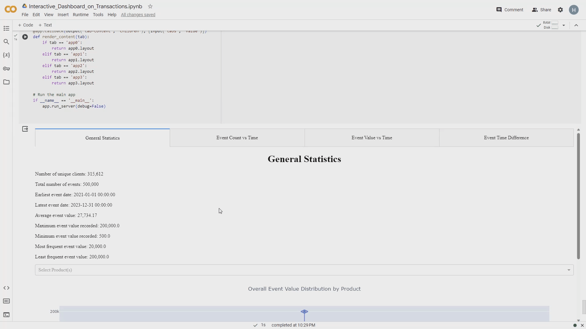

# Interactive Dashboard on Transaction Data
  
This project visualizes exploratory data analysis on a event-based transaction dataset in an interactive dashboard.

## Description
  
- The project is a demo of my summer internship project with a fintech startup.
- For NDA purpose, mock dataset is made specifically for this demo. 
- The dashboard provides insights on customer bahaviors and product trends from different perspectives.
- The dashboard consists of 4 tabs:
    - General Statistics: Provides descriptive statistics on the dataset.
    - Event Count: Provides deeper insights on the numbers of transactions over selectable time period.
    - Event Value: Serves to understand the average transaction values over selectable time period.
    - Event Time Difference: Explore customer behaviors by observing the time difference between transactions for each customer.

## Demo 
  
  - General Statistics

  - Event Count 

  - Event Value
 
  - Event Time Difference

